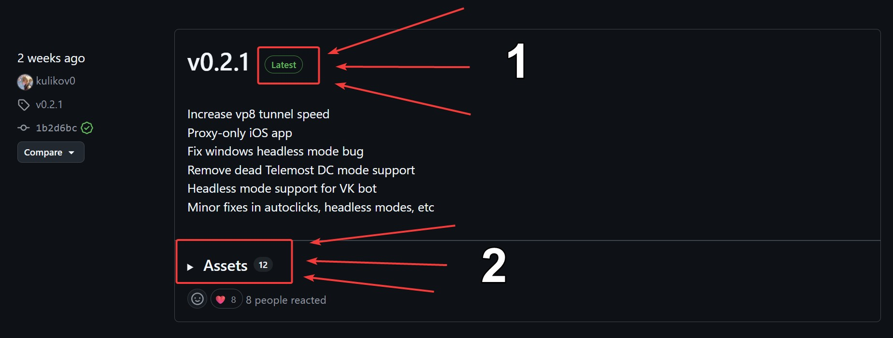
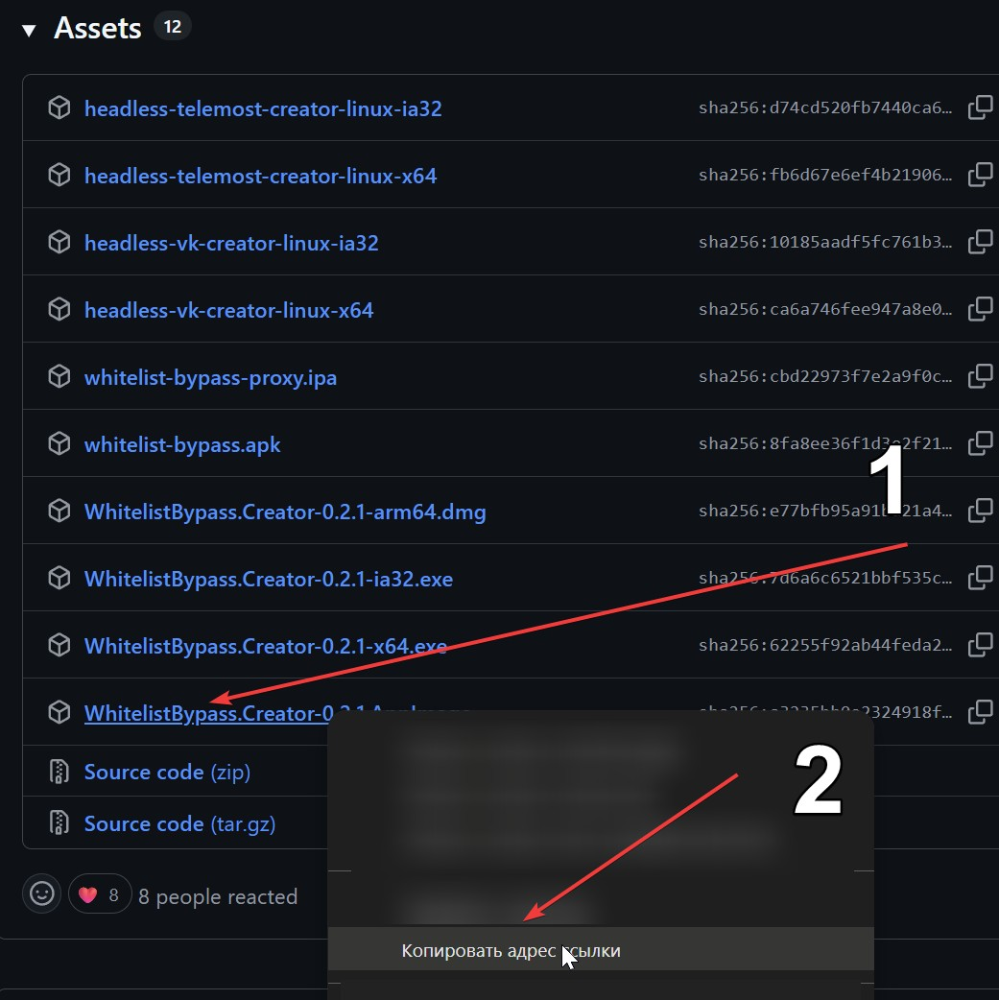
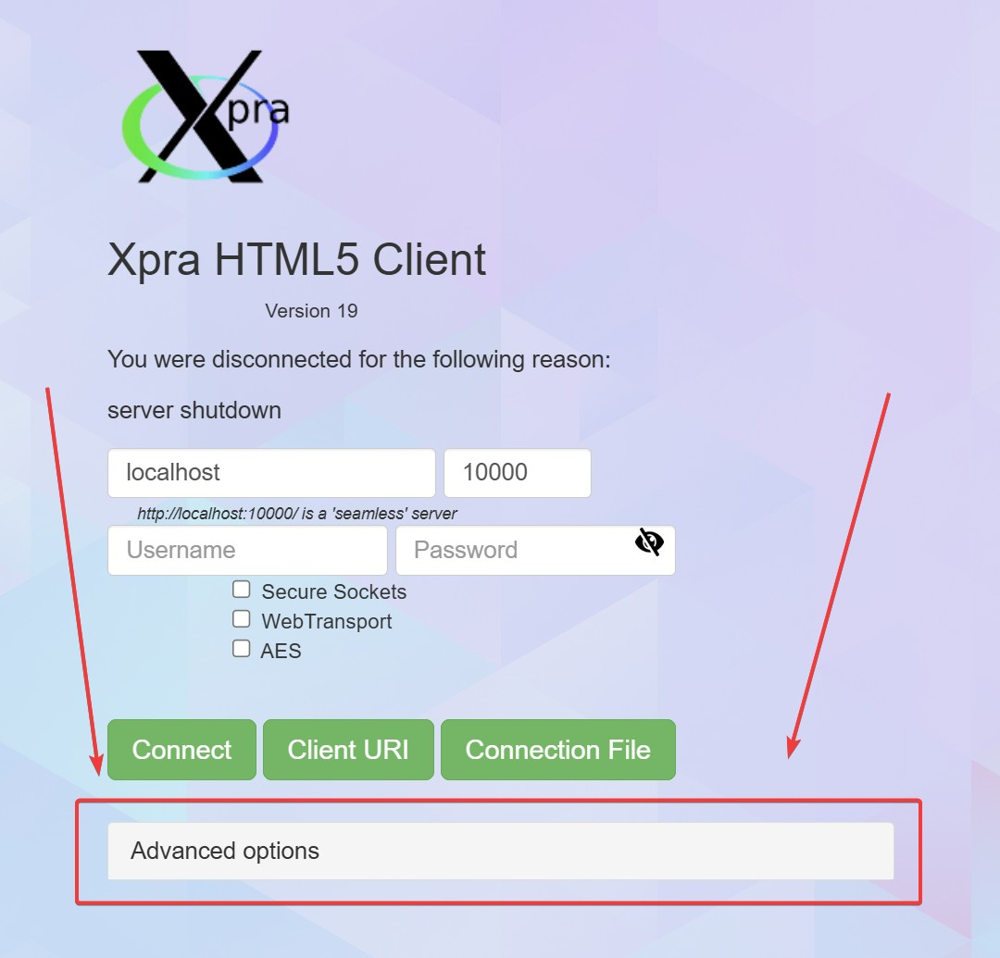
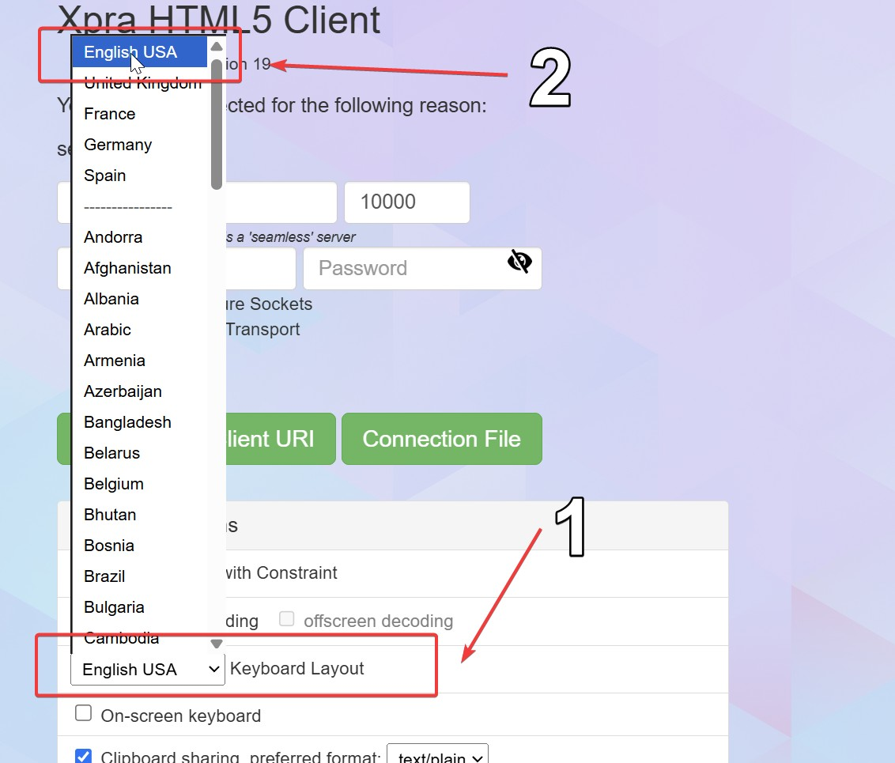

# اجرای Creator روی VPS

> English: [docs/en/VPS.md](../en/VPS.md)

این راهنما دو روش برای اجرای Creator روی VPS لینوکس بدون نمایشگر محلی را پوشش می‌دهد.

- **هدلس (توصیه‌شده)** - باینری Go خالص، بدون Electron و بدون display server. ساده‌ترین مسیر؛ پیشنهاد برای دیپلوی‌های پروداکشن.
- **GUI روی XPRA** - اجرای Creator گرافیکی Electron روی سرور و forward کردن پنجره آن به مرورگر لپ‌تاپ از طریق XPRA. فقط زمانی استفاده کنید که واقعاً به رابط دسکتاپ روی VPS نیاز دارید (مثلاً دیباگ ورود به بله به‌صورت تعاملی).

## پیش‌نیازها

تست شده روی:
- 1 vCPU
- 1 GB RAM
- Ubuntu 22.04 / Debian 12

## فهرست

- [گزینه A - Creator هدلس](#گزینه-a---creator-هدلس)
- [گزینه B - GUI روی XPRA](#گزینه-b---gui-روی-xpra)

## گزینه A - Creator هدلس

باینری Go خالص. بدون مرورگر، بدون Electron، بدون محیط گرافیکی.

### 1. آماده‌سازی کوکی‌ها

Creator هدلس با کوکی‌هایی که از Creator دسکتاپ خارج می‌شوند احراز هویت می‌کند:

1. روی یک دستگاه دسکتاپ (ویندوز / مک / لینوکس)، اپ Creator را از [ریلیز](https://github.com/kulikov0/whitelist-bypass-iran/releases) دانلود کنید و یک‌بار به بله وارد شوید.
2. روی **Bale Cookies** کلیک کنید تا `bale-cookies.json` ایجاد شود.
3. فایل را به VPS کپی کنید، مثلاً `/etc/whitelist-bypass/bale-cookies.json`.

### 2. دانلود باینری

از [گیت‌هاب ریلیز](https://github.com/kulikov0/whitelist-bypass-iran/releases) باینری `headless-bale-creator-linux-*` متناسب با معماری سرور را دانلود کنید:

```sh
# مثال: سرور x64
wget -O /usr/local/bin/headless-bale-creator \
  https://github.com/kulikov0/whitelist-bypass-iran/releases/latest/download/headless-bale-creator-linux-x64
sudo chmod +x /usr/local/bin/headless-bale-creator
```

### 3. اجرا

```sh
/usr/local/bin/headless-bale-creator \
  --cookies /etc/whitelist-bypass/bale-cookies.json \
  --write-file /var/run/whitelist-bypass/call.txt
```

در شروع اجرا، باینری چیزی شبیه این چاپ می‌کند:

```
CALL CREATED
  join_link: https://meet.bale.ai/i/<code>
  protocol:  api 1 mkproto 1
```

`join_link` را برای Joiner بفرستید. همین لینک به فایل `--write-file` هم اضافه می‌شود، یک خط در هر تماس - مفید برای ابزارها.

### 4. سرویس systemd (اجرای خودکار)

`/etc/systemd/system/wlb-bale-creator.service`:

```ini
[Unit]
Description=Whitelist Bypass Bale Creator (headless)
After=network-online.target
Wants=network-online.target

[Service]
Type=simple
ExecStart=/usr/local/bin/headless-bale-creator \
  --cookies /etc/whitelist-bypass/bale-cookies.json \
  --write-file /var/run/whitelist-bypass/call.txt \
  --resources default
Restart=always
RestartSec=5
User=wlb
RuntimeDirectory=whitelist-bypass

[Install]
WantedBy=multi-user.target
```

فعال‌سازی و مشاهده لاگ:

```sh
sudo useradd -r -s /usr/sbin/nologin wlb 2>/dev/null || true
sudo systemctl daemon-reload
sudo systemctl enable --now wlb-bale-creator
sudo journalctl -u wlb-bale-creator -f
```

تا زمانی که سرویس در حال اجراست، لینک تماس فعال در `/var/run/whitelist-bypass/call.txt` قرار دارد. اگر کوکی‌های بله منقضی شوند، سرویس در حالت `WAITING_FOR_COOKIES` ری‌استارت می‌کند - `bale-cookies.json` را دوباره از Creator دسکتاپ خارج کنید و فایل روی سرور را جایگزین کنید.

### 5. حالت‌های منابع

پرچم `--resources` باینری را با اندازه VPS تنظیم کنید:

| RAM VPS | حالت پیشنهادی |
|---|---|
| <= 512 MB | `moderate` |
| 1 GB | `default` |
| >= 2 GB یا هاست اختصاصی | `unlimited` |

برای جزئیات هر حالت [SETUP اصلی](SETUP.md#حالت-های-منابع) را ببینید.

## گزینه B - GUI روی XPRA

فقط زمانی استفاده کنید که واقعاً به رابط دسکتاپ Creator روی سرور نیاز دارید. در غیر این صورت گزینه A ساده‌تر است.

### 1. نصب XPRA

XPRA پنجره یک اپلیکیشن را از VPS به مرورگر لپ‌تاپ شما forward می‌کند. [دستورالعمل دانلود XPRA](https://github.com/Xpra-org/xpra/wiki/Download#-linux) یا این تک‌خطی:

```sh
curl https://xpra.org/get-xpra.sh | bash
```

### 2. پیدا کردن لینک AppImage فایل Creator

- به [صفحه ریلیزها](https://github.com/kulikov0/whitelist-bypass-iran/releases) بروید و آخرین تگ (با برچسب `latest`) را انتخاب کنید.
- بخش **Assets** را باز کنید و فایلی که با `.AppImage` تمام می‌شود را پیدا کنید - بیلد لینوکس Creator همین است.

  

- روی لینک `.AppImage` راست‌کلیک کنید و **Copy link address** را انتخاب کنید.

  

### 3. نصب وابستگی‌های AppImage

```sh
sudo add-apt-repository universe
sudo apt install libfuse2
```

### 4. دانلود و نصب Creator

```sh
wget https://github.com/kulikov0/whitelist-bypass-iran/releases/download/v0.1.0/Whitelist.Bypass.Creator.Iran-0.1.0.AppImage
mv *.AppImage creator.AppImage
chmod +x creator.AppImage
sudo mv creator.AppImage /usr/bin/whitelist-bypass-creator
```

### 5. اسکریپت‌های کمکی

اسکریپت توقف:

```sh
sudo tee /usr/bin/whitelist-bypass-stop > /dev/null << 'EOF'
#!/usr/bin/env bash
xpra stop 100
EOF
sudo chmod +x /usr/bin/whitelist-bypass-stop
```

اسکریپت شروع:

```sh
sudo tee /usr/bin/whitelist-bypass-start > /dev/null << 'EOF'
#!/usr/bin/env bash
xpra start :100 --pulseaudio=no --webcam=no --mdns=no --resize-display=1200x900 \
  --attach=yes --daemon=no --html=on --bind-tcp=127.0.0.1:10000 \
  --start='xterm -e whitelist-bypass-creator --no-sandbox'
EOF
sudo chmod +x /usr/bin/whitelist-bypass-start
```

### 6. اجرای خودکار با systemd

> اگر اجرای خودکار پس از ری‌بوت VPS لازم نیست، این قسمت را رد کنید.

```sh
sudo tee /etc/systemd/system/whitelist-bypass-start.service > /dev/null << 'EOF'
[Unit]
Description=Whitelist Bypass Creator Service
Documentation=https://github.com/kulikov0/whitelist-bypass-iran/
After=xpra-server.service

[Service]
Type=simple
ExecStart=bash /usr/bin/whitelist-bypass-start

[Install]
WantedBy=multi-user.target
EOF

sudo systemctl daemon-reload
sudo systemctl enable whitelist-bypass-start.service
sudo systemctl start whitelist-bypass-start.service
sudo reboot
```

> ری‌بوت VPS گاهی طول می‌کشد - صبور باشید.

### 7. اتصال از لپ‌تاپ شما

> اگر مرحله اجرای خودکار را رد کردید، SSH بزنید و `whitelist-bypass-start` را اجرا کنید.

پورت XPRA را روی SSH تونل کنید:

```sh
ssh vps-username@vps-ip -NL 10000:localhost:10000
```

این ترمینال را تا پایان کار با Creator باز نگه دارید.

در مرورگر `http://localhost:10000/connect.html` را باز کنید.

در دیالوگ اتصال، **Advanced Options** را باز کنید:



**Keyboard Layout** را روی **English USA** قرار دهید:



روی دکمه سبز **Connect** کلیک کنید. پس از اتصال، پنجره Creator داخل مرورگر ظاهر می‌شود - مثل یک Creator دسکتاپ معمولی با آن کار کنید.
